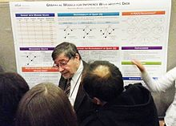

<table class="infobox biography vcard">
<tbody>
<tr>
<th colspan="2">

Judea Pearl

</th>
</tr>
<tr>
<td colspan="2">

Judea Pearl at&nbsp;<a title="Conference on Neural Information Processing Systems" href="https://en.wikipedia.org/wiki/Conference_on_Neural_Information_Processing_Systems">NIPS</a>&nbsp;2013

</td>
</tr>
<tr>
<th scope="row">Born</th>
<td>September 4, 1936&nbsp;(age&nbsp;84) 

<a title="Tel Aviv" href="https://en.wikipedia.org/wiki/Tel_Aviv">Tel Aviv</a>,&nbsp;<a title="Mandatory Palestine" href="https://en.wikipedia.org/wiki/Mandatory_Palestine">Mandatory Palestine</a> (present day Israel)

</td>
</tr>
<tr>
<th scope="row">Nationality</th>
<td class="category">Israeli-American</td>
</tr>
<tr>
<th scope="row">Alma&nbsp;mater</th>
<td><a title="Technion &ndash; Israel Institute of Technology" href="https://en.wikipedia.org/wiki/Technion_%E2%80%93_Israel_Institute_of_Technology">Technion &ndash; Israel Institute of Technology</a> <a title="New Jersey Institute of Technology" href="https://en.wikipedia.org/wiki/New_Jersey_Institute_of_Technology">New Jersey Institute of Technology</a> <a title="Rutgers University" href="https://en.wikipedia.org/wiki/Rutgers_University">Rutgers University</a> <a title="New York University Tandon School of Engineering" href="https://en.wikipedia.org/wiki/New_York_University_Tandon_School_of_Engineering">New York University Tandon School of Engineering</a></td>
</tr>
<tr>
<th scope="row">Known&nbsp;for</th>
<td><a class="mw-redirect" title="Artificial Intelligence" href="https://en.wikipedia.org/wiki/Artificial_Intelligence">Artificial Intelligence</a> <a title="Causality" href="https://en.wikipedia.org/wiki/Causality">Causality</a> <a class="mw-redirect" title="Bayesian Network" href="https://en.wikipedia.org/wiki/Bayesian_Network">Bayesian Networks</a></td>
</tr>
<tr>
<th scope="row">Spouse(s)</th>
<td>Ruth</td>
</tr>
<tr>
<th scope="row">Children</th>
<td><a title="Daniel Pearl" href="https://en.wikipedia.org/wiki/Daniel_Pearl">Daniel</a>, Tamara, Michelle</td>
</tr>
<tr>
<th scope="row">Awards</th>
<td><a title="IJCAI Award for Research Excellence" href="https://en.wikipedia.org/wiki/IJCAI_Award_for_Research_Excellence">IJCAI Award for Research Excellence</a>&nbsp;(1999) <a title="Turing Award" href="https://en.wikipedia.org/wiki/Turing_Award">Turing Award</a>&nbsp;(2011) <a title="Rumelhart Prize" href="https://en.wikipedia.org/wiki/Rumelhart_Prize">Rumelhart Prize</a>&nbsp;(2011) <a title="Harvey Prize" href="https://en.wikipedia.org/wiki/Harvey_Prize">Harvey Prize</a>&nbsp;(2011)</td>
</tr>
<tr>
<td colspan="2"><strong>Scientific career</strong></td>
</tr>
<tr>
<th scope="row">Fields</th>
<td class="category"><a title="Computer science" href="https://en.wikipedia.org/wiki/Computer_science">Computer science</a>,&nbsp;<a title="Statistics" href="https://en.wikipedia.org/wiki/Statistics">statistics</a></td>
</tr>
<tr>
<th scope="row"><a title="Thesis" href="https://en.wikipedia.org/wiki/Thesis">Thesis</a></th>
<td><em><a title="Pearl vortex" href="https://en.wikipedia.org/wiki/Pearl_vortex">Vortex Theory of Superconductive Memories</a></em>&nbsp;(1965)</td>
</tr>
<tr>
<th scope="row"><a title="Doctoral advisor" href="https://en.wikipedia.org/wiki/Doctoral_advisor">Doctoral advisor</a></th>
<td>L. Strauss L. Bergstein</td>
</tr>
<tr>
<th scope="row">Website</th>
<td><a class="external free" href="http://bayes.cs.ucla.edu/jp_home.html" rel="nofollow">http://bayes.cs.ucla.edu/jp_home.html</a></td>
</tr>
</tbody>
</table>
 

<strong>Judea Pearl</strong>&nbsp;(born September 4, 1936) is an Israeli-American&nbsp;<a title="Computer scientist" href="https://en.wikipedia.org/wiki/Computer_scientist">computer scientist</a>&nbsp;and&nbsp;<a title="Philosopher" href="https://en.wikipedia.org/wiki/Philosopher">philosopher</a>, best known for championing the probabilistic approach to&nbsp;<a title="Artificial intelligence" href="https://en.wikipedia.org/wiki/Artificial_intelligence">artificial intelligence</a>&nbsp;and the development of&nbsp;<a class="mw-redirect" title="Bayesian networks" href="https://en.wikipedia.org/wiki/Bayesian_networks">Bayesian networks</a>&nbsp;(see the article on&nbsp;<a title="Belief propagation" href="https://en.wikipedia.org/wiki/Belief_propagation">belief propagation</a>). He is also credited for developing a theory of causal and counterfactual inference based on structural models (see article on&nbsp;<a title="Causality" href="https://en.wikipedia.org/wiki/Causality">causality</a>). In 2011, the&nbsp;<a title="Association for Computing Machinery" href="https://en.wikipedia.org/wiki/Association_for_Computing_Machinery">Association for Computing Machinery</a>&nbsp;(ACM) awarded Pearl with the&nbsp;<a title="Turing Award" href="https://en.wikipedia.org/wiki/Turing_Award">Turing Award</a>, the highest distinction in computer science, "for fundamental contributions to artificial intelligence through the development of a calculus for probabilistic and causal reasoning".

Judea Pearl is the father of journalist&nbsp;<a title="Daniel Pearl" href="https://en.wikipedia.org/wiki/Daniel_Pearl">Daniel Pearl</a>, who was kidnapped and murdered by terrorists in&nbsp;<a title="Pakistan" href="https://en.wikipedia.org/wiki/Pakistan">Pakistan</a>&nbsp;connected with Al-Qaeda and the International Islamic Front in 2002 for his American and Jewish heritage.

 

<h2> Publications </h2>

<ul>

 <li><a target="_blank" href="https://github.com/manjunath5496/Judea-Pearl-Publications/blob/master/pearl(1).pdf" style="text-decoration:none;">Causal inference in statistics: A Gentle Introduction</a></li>

 <li><a target="_blank" href="https://github.com/manjunath5496/Judea-Pearl-Publications/blob/master/pearl(2).pdf" style="text-decoration:none;">Causal diagrams for empirical research (with discussions)</a></li>

<li><a target="_blank" href="https://github.com/manjunath5496/Judea-Pearl-Publications/blob/master/pearl(3).pdf" style="text-decoration:none;">Simpson's paradox: An anatomy</a></li>
 <li><a target="_blank" href="https://github.com/manjunath5496/Judea-Pearl-Publications/blob/master/pearl(4).pdf" style="text-decoration:none;">Causes and Explanations: A Structural-Model Approach — Part I: Causes</a></li>                              
<li><a target="_blank" href="https://github.com/manjunath5496/Judea-Pearl-Publications/blob/master/pearl(5).pdf" style="text-decoration:none;">Causes and Explanations: A Structural-Model Approach — Part II: Explanations</a></li>
<li><a target="_blank" href="https://github.com/manjunath5496/Judea-Pearl-Publications/blob/master/pearl(6).pdf" style="text-decoration:none;">The Logic of Counterfactuals in Causal Inference (Discussion of Causal Inference without Counterfactuals</a></li>
 <li><a target="_blank" href="https://github.com/manjunath5496/Judea-Pearl-Publications/blob/master/pearl(7).pdf" style="text-decoration:none;">Probabilities of Causation: Bounds and Identification</a></li>

 <li><a target="_blank" href="https://github.com/manjunath5496/Judea-Pearl-Publications/blob/master/pearl(8).pdf" style="text-decoration:none;"> Direct and Indirect Effects</a></li>
   <li><a target="_blank" href="https://github.com/manjunath5496/Judea-Pearl-Publications/blob/master/pearl(9).pdf" style="text-decoration:none;">A General Identification Condition for Causal Effects</a></li>
  
   
 <li><a target="_blank" href="https://github.com/manjunath5496/Judea-Pearl-Publications/blob/master/pearl(10).pdf" style="text-decoration:none;">Robustness of Causal Claims</a></li>                              
<li><a target="_blank" href="https://github.com/manjunath5496/Judea-Pearl-Publications/blob/master/pearl(11).pdf" style="text-decoration:none;">Causal inference in statistics:
An overview</a></li>
</ul>
